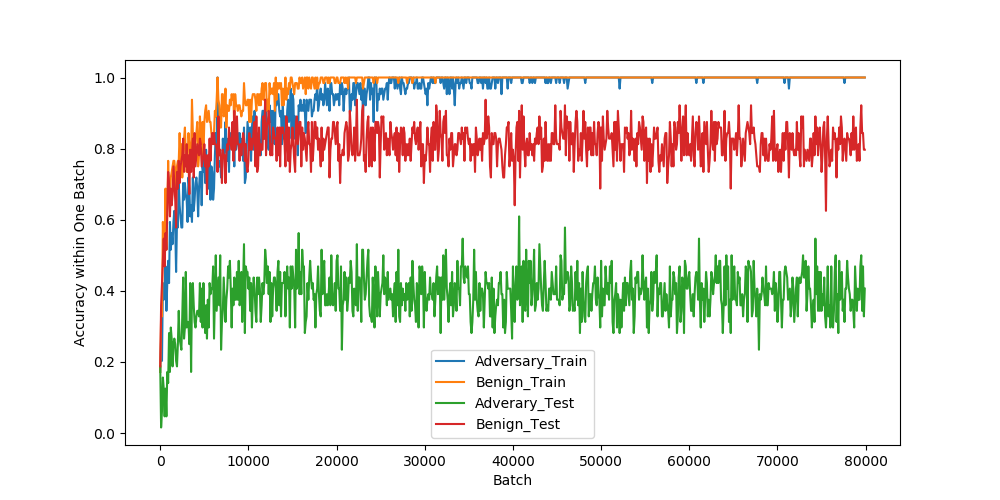
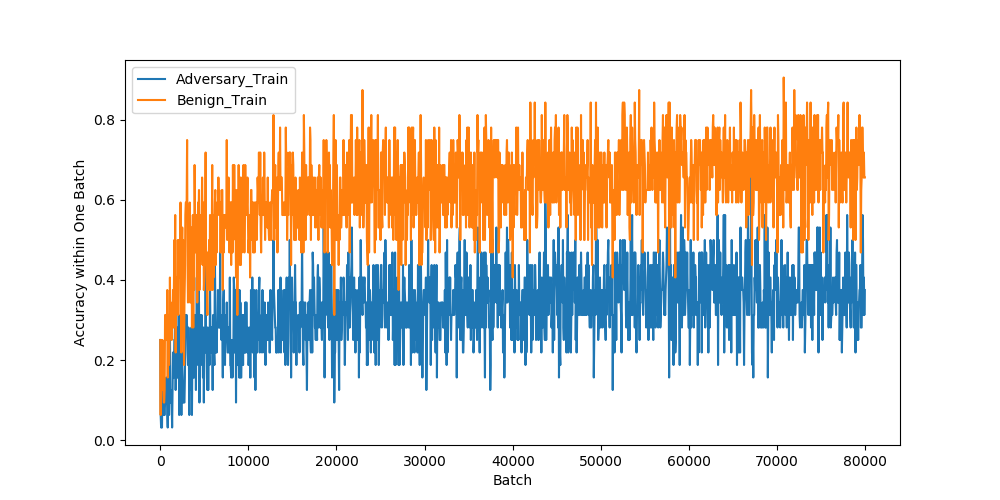
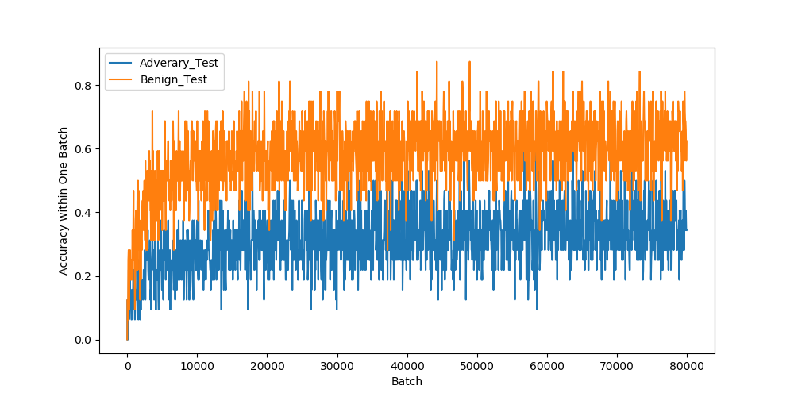

# Details of Adversarial Training 

## Parameter Setting

We adopt a similar setting as [1], which is a common baseline for CIFAR10 adversarial training. We use the Resnet-18 as model, the CIFAR10 as dataset and the Adam as optimizer with the learning rate of 1e-3. We train the classifier for 80000 batches. Each batch consists of 64 images. 

We choose Feature-Space Argumentation Attack as adversary and keeps the same parameter used in Table 3 in the paper. Namely we extract relu2_1 from vgg19 as feature representation, use ln(1.5) as \epsilon in Equation 9 our evaluation. The experiments of adversarial training in paper runs around 2 days on a single RTX2080Ti. 

As a common practice, we increase the attack optimization steps from 50 to 2000 during evaluation.

For more details about implementation, the code is available in "code/attack_adv_trained.py" .

## Learning Curve using Our Attack

We record two types of accuracy, the accuracy for benign samples and the one for adversarial samples. For each type of accuracy, we record it both on the train set and the test set during training. 

This is the learning curve for result reported in the paper. Note that the optimization step increases to 2000 during evaluation. Thus the "Adversary Test" is further dropped to 17% in our evaluation. 

## Learning Curve for Semantic Attack

As a comparison, we also present the learning curve of adversarial training using semantic attack [2]. We tried our best to adapt their implementation to CIFAR10 dataset, and used the best parameter reported in [2].

The hardened model has 62.6% accuracy for benign samples, 31.3% accuracy under semantic attack while 8.9% accuracy under our attack.

Note that the training process is much noisier than ours. And the training result has a lower normal and adversarial accuracy than ours. Such result is expected, since different from our attack, semantic attack neither restricts the adversarial samples in pixel space nor in feature space.

## Stop Criterion

Same as [1], we continuously train the model and stop the training after 102 epochs. 

## Parameter Sensitivity

During rebuttal, we tried our best to fine tune the model parameter. The most influential hyperparameter is optimization step during training. Note that this is a time-versus-performance trade off.

We respectively test step = 50, 100 and 200 during training. The adversarial robustness can be further improved from 17% to 26%. Given the best effort, there is still a large gap between adversarial training result on pixel-space and feature-space.

| Steps                       | 50   | 100  | 200  |
|-----------------------------|------|------|------|
| Accuracy for Benign Samples | 81.9 | 81.7 | 83.6 |
| Accuracy under Our Attack   | 16.7 | 22.0 | 26.3 |

[1] Towards Deep Learning Models Resistant to Adversarial Attacks

[2] Unrestricted adversarial examples via semantic manipulation
