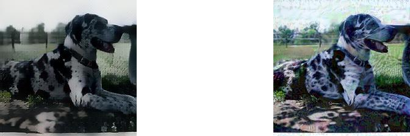
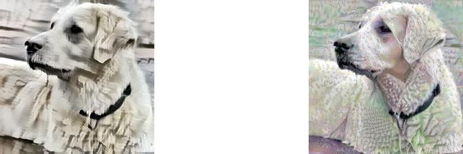
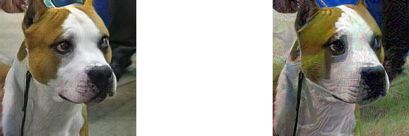
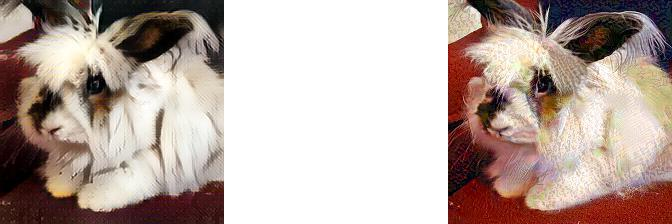
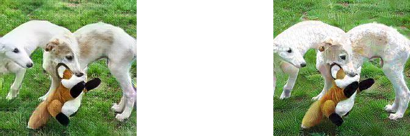

# Feature Space Images
Here attaches 200 samples of images used for human study. 40% users favor Feature Space samples and 60% favors PGD.

The left one is from feature space attack, the right one is from PGD.

We select several images of dogs as a demonstration. For more images, please refer to the directory posted.

# Code 

We also attaches the code here. It's a development version. We introduce how to use the main function of the code. While generally people need to configure it before usage.

The code is based on Python 3, Tensorflow 1.14.

We modify the code based on a arbitrary style transfer implementation. https://github.com/elleryqueenhomels/arbitrary_style_transfer. You will need to download corresponding VGG-19 parameters and set up ImageNet dataset in advance.

Each file has a header in code, which specify the dataset, the model for attack and the decoder you choose. Before running each file, you need to change that header to meet your requirement.

To train an encoder, Please python train.py.

To run Feature Argumentation Attack, please use "python attack.py".

To run Feature Interpolation Attack, please use "python polygonattack.py".

To run the dKNN feature space detection experiment , please use "python attack_deepknn.py".

To run the Pixel_DP defense, please use "python attack_pixeldp.py".

