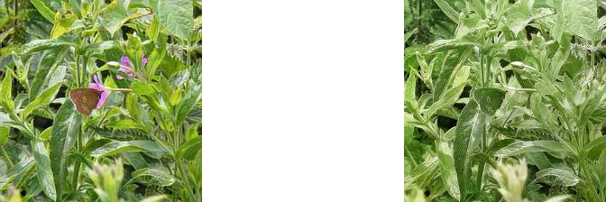
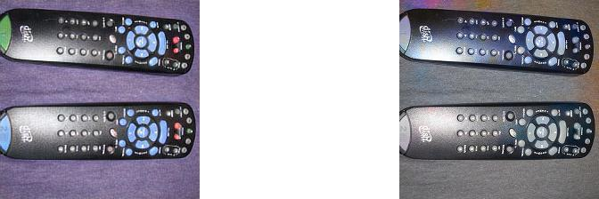
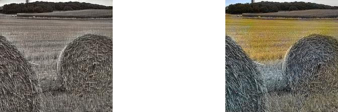
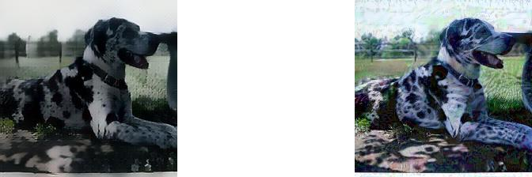
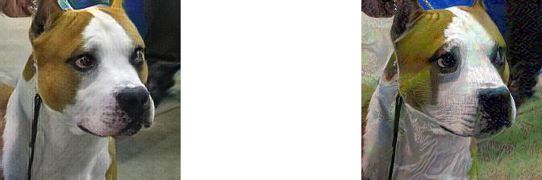
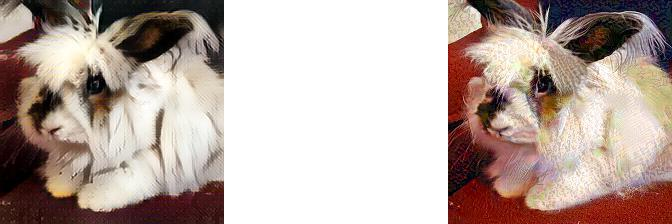
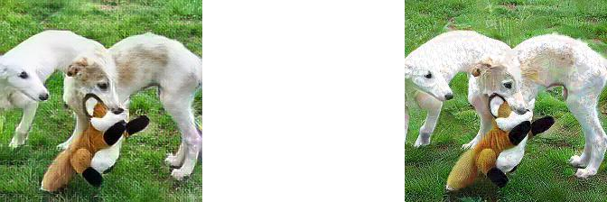

# Human Preference Study

Here attaches 250 samples of images used for human preference study. 

## Compared with Color Attack

We first compare Feature Space Attack with Semantic Color Attack in "./human/FSvsSemantic". 67% users favor Feature Space Attack and 33% users favor Semantic Attack. We select several images for illustration. The left one is from feature space attack, the right one is from color attack.

## Compared with PGD

We then compare Feature Space Attack with PGD in "./human/FSvsPGD". 40% users favor Feature Space samples and 60% favors PGD.
We select several images of animals as a demonstration. For more images, please refer to the directory posted. The left one is from feature space attack, the right one is from PGD.

# Code 

We also attaches the code here. It's a development version. The official version shall be public after paper getting published. We introduce how to use the main function of the code. While generally people need to configure it before usage.

The code is based on Python 3, Tensorflow 1.14.

We modify the code based on a arbitrary style transfer implementation. https://github.com/elleryqueenhomels/arbitrary_style_transfer. You will need to download corresponding VGG-19 parameters and set up ImageNet dataset in advance.

Each file has a header in code, which specify the dataset, the model for attack and the decoder you choose. Before running each file, you need to change that header to your specific decoder and dataset. Ahead of running attack, one must first train the corresponding decoder first.

To train an decoder, Please use "python train.py".

To run Feature Argumentation Attack, please use "python attack.py".

To run Feature Interpolation Attack, please use "python polygonattack.py".

To run the dKNN feature space detection experiment , please use "python attack_deepknn.py".

To run the Pixel_DP defense, please use "python attack_pixeldp.py".

